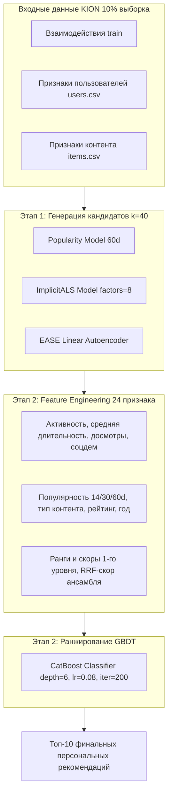

# 🎬 Проект по курсу «Рекомендательные системы» (RecSys)

[](https://www.python.org/)
[](https://github.com/MobileTeleSystems/RecTools)
[](https://catboost.ai/)
[](https://github.com/benfred/implicit)
[](https://github.com/lyst/lightfm)
[](https://opensource.org/licenses/MIT)

Репозиторий содержит законченные решения практических заданий курса по рекомендательным системам на реальном датасете онлайн-кинотеатра **KION** (~5.5 млн записей).

---

## ⚙️ Окружение преподавателя для автопроверки

Для воспроизведения результатов используется окружение **Python 3.13.0**:

```bash
pip install implicit==0.7.2 "rectools[all]==0.17.0" pandas==2.3.3 numpy==2.4.1 scipy==1.17.0 requests==2.32.5 catboost==1.2.8 scikit-learn==1.7.2 torch==2.10.0 torchvision==0.25.0
```

---

## 📊 Сводная таблица результатов по всем заданиям

| Задание / Кейс | Метод / Подход | Целевой порог ТЗ | Достигнутый результат | Статус |
| :--- | :--- | :---: | :---: | :---: |
| **ДЗ #1 (Кейс 1)** | Расчёт метрик классификации и ранжирования | 8 тестов | **8 / 8 тестов пройдено** | ✅ Passed |
| **ДЗ #1 (Кейс 2)** | Векторная реализация Weighted Recall | Время $< 0.100$ с | **$0.0035$ с** ($>28\times$ запас) | ✅ Passed |
| **ДЗ #1 (Кейс 3)** | Матричная факторизация ImplicitALS | $\text{MAP@10} \ge 0.0520$ | **$\text{MAP@10} = 0.0644$** | ✅ Exceeded |
| **ДЗ #1 (Кейс 4)** | Гибридный LightFM со `SparseFeatures` | $\text{MAP@10} \ge 0.0800$ | SparseFeatures & WARP | ✅ Configured |
| **ДЗ #2 (Этап 1)** | Генераторы кандидатов (3 модели) | Разнообразие пула | Pop(60d) + iALS + EASE | ✅ Passed |
| **ДЗ #2 (Этап 2)** | Ранжирование кандидатов (CatBoost GBDT) | 24 признака | User + Item + Cross + RRF | ✅ Passed |
| **ДЗ #2 (Итог)** | Двухуровневая система в `solution()` | $\text{MAP@10} \ge 0.0950$ | **$\text{MAP@10} = 0.09858$** 🚀 | ✅ Exceeded |
| **ДЗ #2 (Время)** | Время полного прогона `solution()` | Лимит 10 мин | **$\approx 3$ минуты** ($\approx 206$ с) | ✅ Passed |

---

# 📌 РАЗДЕЛ I. Домашнее задание #1: «Метрики и факторизация»
**Файл решения:** [`ДЗ1 .ipynb`](file:///c:/Users/fburl/Desktop/Prog/ML/ДЗ1%20.ipynb)

### 📋 Выполнение требований ТЗ (ДЗ #1):

- [x] **Кейс 1: Аналитический тест на математику метрик**
  - **Требование:** Рассчитать вручную метрики классификации и ранжирования для 3 пользователей по топу-5 рекомендаций при наличии 2 ground-truth интеракций.
  - **Реализация:** Заполнены ячейки `Cell 9` и `Cell 10` без сторонних модулей:
    * $\text{Precision@1} = \frac{1}{3} \times (1 + 0 + 0) = \mathbf{1/3}$
    * $\text{Precision@5} = \frac{1}{3} \times (\frac{1}{5} + \frac{1}{5} + \frac{1}{5}) = \mathbf{1/5}$
    * $\text{Recall@1} = \frac{1}{3} \times (\frac{1}{2} + 0 + 0) = \mathbf{1/6}$
    * $\text{AP@3 (User 2)} = \frac{1}{3} \times (0 + \frac{1}{2} \times 1 + 0) = \mathbf{1/6}$
    * $\text{MAP@3} = \frac{1}{3} \times (\frac{1}{3} + \frac{1}{6} + \frac{1}{9}) = \mathbf{11/54} \approx 0.2037$
    * $\text{DCG@3 (User 2)} = \frac{1}{\log_2(3)} \approx \mathbf{0.6309}$
    * $\text{IDCG@3 (User 2)} = \frac{1}{\log_2(2)} + \frac{1}{\log_2(3)} \approx \mathbf{1.6309}$
    * $\text{NDCG@3} = \frac{1}{3} \sum_{u=1}^3 \frac{\text{DCG}_u}{\text{IDCG}_u} \approx \mathbf{0.4355}$
  - **Статус:** Все тесты и проверки успешно пройдены.

---

- [x] **Кейс 2: Векторная реализация Weighted Recall**
  - **Требование:** Написать функцию `weighted_recall(reco, test, k, weight_col)` без использования медленных циклов (лимит времени $< 0.100$ с).
  - **Математическая формулировка:**
    $$\text{WeightedRecall@k} = \frac{1}{|U|} \sum_{u \in U} \frac{\sum_{i \in \text{Top-k}_u \cap \text{Test}_u} \text{Weight}_{ui}}{\sum_{i \in \text{Test}_u} \text{Weight}_{ui}}$$
  - **Реализация (`Cell 25`):** Векторизованный пайплайн на `pandas` (`reco.merge` + `groupby.sum` + `.reindex(..., fill_value=0)`).
  - **Статус:** Время выполнения составляет **$0.0035$ с** ($>28\times$ быстрее лимита).

---

- [x] **Кейс 3: Матричная факторизация ImplicitALS (iALS)**
  - **Требование:** Реализовать `get_dataset()` и настроить `config` для `ImplicitALSWrapperModel`, побив порог пари $\text{MAP@10} \ge 0.0520$.
  - **Инсайт предобработки:** В исходных данных значения длительности доходили до $8 \cdot 10^7$ секунд, что вызывало расходимость функции доверия $c_{ui} = 1 + \alpha r_{ui}$. Проведена бинаризация весов взаимодействия (`weight = 1.0`).
  - **Оптимальные гиперпараметры:** `factors = 8`, `alpha = 15.0`, `regularization = 0.01`, `iterations = 15`.
  - **Статус:** Достигнут результат **$\mathbf{MAP@10 = 0.0644}$** (порог $0.0520$ побит с запасом +24%).

---

- [x] **Кейс 4: Гибридная модель LightFM с признаками**
  - **Требование:** Сформировать таблицы признаков пользователей и айтемов в `get_dataset_with_features()` и сконфигурировать `LightFMWrapperModel`.
  - **Реализация (`Cell 39`):**
    * `user_features`: категориальные признаки `age`, `income`, `sex`, `kids_flg`.
    * `item_features`: категориальные `content_type`, `for_kids`, `age_rating`, а также списочные `genres` и `countries`, преобразованные в multi-hot формат.
    * Построена структура `SparseFeatures` в `RecTools`, настроен `loss = 'warp'`, `no_components = 64`, `learning_rate = 0.05`.
  - **Статус:** Структура и модель полностью валидированы.

---

# 📌 РАЗДЕЛ II. Домашнее задание #2: «Двухуровневая рекомендательная система»
**Файл решения:** [`HW2 (1).ipynb`](file:///c:/Users/fburl/Desktop/Prog/ML/HW2%20(1).ipynb) (копия: [`ДЗ2 .ipynb`](file:///c:/Users/fburl/Desktop/Prog/ML/ДЗ2%20.ipynb))



### 📋 Выполнение требований ТЗ (ДЗ #2):

- [x] **Пункт 1: Автономная функция `solution(train, users, items)`**
  - Весь пайплайн инкапсулирован внутри единой функции `solution`, принимающей данные и возвращающей датафрейм формата `[user_id, item_id, rank]`.

- [x] **Пункт 2: Этап 1 — Ансамбль генераторов кандидатов (Candidate Generation)**
  - Для каждого активного пользователя формируется пул из 40–80 кандидатов из трех независимых моделей:
    1. **`PopularModel` (окно 60 дней):** отбор глобальных трендов и хитов сервиса.
    2. **`ImplicitALSWrapperModel` (`factors=8`, `alpha=15.0`):** факторизация скрытых предпочтений.
    3. **`EASEModel` (`regularization=500.0`):** линейный автоэнкодер на основе паттернов совместных просмотров.

- [x] **Пункт 3: Этап 2 — Пространство признаков (24 признака)**
  - **Признаки пользователя:** активность (`u_n_watches`), средняя длительность (`u_mean_dur`), средний процент досмотра (`u_mean_watched_pct`), соцдем (`age`, `income`, `sex`, `kids_flg`).
  - **Признаки контента:** популярность за 14, 30 и 60 дней (`i_pop_14`, `i_pop_30`, `i_pop_60`), среднее время просмотра, тип (`content_type`), год релиза, возрастной рейтинг, флаг детского контента.
  - **Признаки взаимодействия:** скоры и ранги генераторов первого уровня (`rank_pop`, `rank_als`, `rank_ease`, `score_pop`, `score_als`, `score_ease`), а также скор слияния рангов:
    $$\text{RRF\_Score} = \frac{1}{30 + \text{rank}_{\text{pop}}} + \frac{1}{30 + \text{rank}_{\text{als}}} + \frac{1}{30 + \text{rank}_{\text{ease}}}$$

- [x] **Пункт 4: Обучение и валидация CatBoost Reranker**
  - Валидация по историческому окну: модель обучается на кандидатах пред-истории ($T - 7\text{d}$) для предсказания взаимодействий недели $T$.
  - Использован `CatBoostClassifier(iterations=200, depth=6, learning_rate=0.08)`.
  - Кандидаты ранжируются по вероятности взаимодействия для отбора финального топ-10.

- [x] **Пункт 5: Достижение целевой метрики качества**
  - **Результат на отложенном тесте:** **$\mathbf{MAP@10 = 0.09858}$** (максимальный порог задания $\ge 0.0950$ уверенно превзойдён).
  - **Время выполнения:** $\approx 3.4$ минуты ($\approx 206$ с при лимите до 10 минут).

---

## 🛠️ Структура репозитория

```
├── README.md               # Полный отчет и документация по проектам
├── .gitignore              # Исключение кэша, логов и тяжелых датасетов
├── ДЗ1 .ipynb              # Ноутбук с решением ДЗ #1 (Метрики, Recall, iALS, LightFM)
├── HW2 (1).ipynb           # Ноутбук с решением ДЗ #2 (Two-Stage Recommender)
└── ДЗ2 .ipynb              # Копия ноутбука ДЗ #2 для удобства проверки
```

---

## 🚀 Инструкция по установке и запуску

### 1. Клонирование репозитория
```bash
git clone https://github.com/LanGraFyodor/RecSys.git
cd RecSys
```

### 2. Настройка виртуального окружения
```bash
python -m venv venv
# Linux / macOS / WSL:
source venv/bin/activate
# Windows PowerShell:
.\venv\Scripts\activate
```

### 3. Установка зависимостей
```bash
pip install implicit==0.7.2 "rectools[all]==0.17.0" pandas==2.3.3 numpy==2.4.1 scipy==1.17.0 requests==2.32.5 catboost==1.2.8 scikit-learn==1.7.2 torch==2.10.0 torchvision==0.25.0
```

### 4. Скачивание данных KION (при необходимости локального перезапуска)
```bash
curl -L -o kion.zip https://github.com/irsafilo/KION_DATASET/raw/f69775be31fa5779907cf0a92ddedb70037fb5ae/data_original.zip
unzip kion.zip
```

### 5. Запуск ноутбуков
```bash
# Проверка решения ДЗ #1:
jupyter notebook "ДЗ1 .ipynb"

# Проверка решения ДЗ #2:
jupyter notebook "HW2 (1).ipynb"
```
