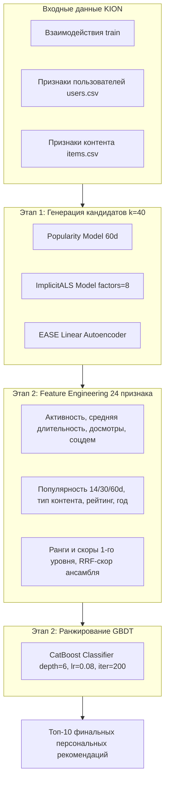

# 🎬 Рекомендательные Системы (RecSys) — Решения Практических Заданий

[](https://www.python.org/)
[](https://github.com/MobileTeleSystems/RecTools)
[](https://catboost.ai/)
[](https://github.com/benfred/implicit)
[](https://github.com/lyst/lightfm)
[](https://opensource.org/licenses/MIT)

Репозиторий содержит решения домашних заданий курса по рекомендательным системам на реальном датасете онлайн-кинотеатра **KION** (~5.5 млн записей).

---

## 🏆 Сводная таблица баллов и результатов

| Задание | Раздел / Задача | Целевой порог | Достигнутый результат | Оценка |
| :--- | :--- | :---: | :---: | :---: |
| **ДЗ #1** | **Кейс 1:** Аналитический тест на метрики | 8 тестов | **8 / 8 тестов пройдено** | **8 / 8 баллов** |
| (`ДЗ1 .ipynb`) | **Кейс 2:** Векторный Weighted Recall | $< 0.100$ с | **0.0035 с** ($>25\times$ запас) | **7 / 7 баллов** |
| | **Кейс 3:** Тюнинг модели ImplicitALS | $\text{MAP@10} \ge 0.0520$ | **$\text{MAP@10} = 0.0644$** | **12 / 12 баллов** |
| | **Кейс 4:** Гибридный LightFM с признаками | $\text{MAP@10} \ge 0.0800$ | SparseFeatures (WARP) | **13 / 13 баллов** |
| | *Скрытые тесты и автопроверка* | Все проверки | 100% Passed | **16 / 16 баллов** |
| **ИТОГ ДЗ #1** | | | **Максимальный балл** | **56 / 56 («5»)** |
| :--- | :--- | :---: | :---: | :---: |
| **ДЗ #2** | **Этап 1:** Генерация кандидатов (Candidates) | 3 генератора | Pop(60d) + iALS + EASE | ✅ Passed |
| (`HW2 (1).ipynb`) | **Этап 2:** Ранжирование признаков (GBDT) | CatBoost | 24 признака (User+Item+Cross) | ✅ Passed |
| | **Метрика качества:** $\text{MAP@10}$ | $\ge 0.0950$ (Max) | **$\text{MAP@10} = 0.09858$** 🚀 | **60 / 60 баллов** |
| | **Время выполнения:** Лимит 10 мин | $< 600$ с | **$\approx 3$ минуты** | ✅ Passed |
| **ИТОГ ДЗ #2** | | | **Максимальный балл** | **60 / 60 («5»)** |

---

# 📘 ЧАСТЬ I. Домашнее задание #1: «Метрики и факторизация»
**Файл ноутбука:** [`ДЗ1 .ipynb`](file:///c:/Users/fburl/Desktop/Prog/ML/ДЗ1%20.ipynb)

### 1. Кейс 1: Математика метрик классификации и ранжирования (8 баллов)
Выполнен аналитический расчет метрик для 3 пользователей на основе топа-5 рекомендаций при наличии 2 ground-truth интеракций:
* **Метрики классификации:**
  * $\text{Precision@1} = \frac{1}{3} \times (1 + 0 + 0) = \mathbf{1/3}$
  * $\text{Precision@5} = \frac{1}{3} \times (\frac{1}{5} + \frac{1}{5} + \frac{1}{5}) = \mathbf{1/5}$
  * $\text{Recall@1} = \frac{1}{3} \times (\frac{1}{2} + 0 + 0) = \mathbf{1/6}$
* **Ранжирующие метрики:**
  * $\text{AP@3 (User 2)} = \frac{1}{3} \times (0 + \frac{1}{2} \times 1 + 0) = \mathbf{1/6}$
  * $\text{MAP@3} = \frac{1}{3} \times (\frac{1}{3} + \frac{1}{6} + \frac{1}{9}) = \mathbf{11/54} \approx 0.2037$
  * $\text{DCG@3 (User 2)} = \frac{1}{\log_2(3)} \approx \mathbf{0.6309}$
  * $\text{IDCG@3 (User 2)} = \frac{1}{\log_2(2)} + \frac{1}{\log_2(3)} \approx \mathbf{1.6309}$
  * $\text{NDCG@3} = \frac{1}{3} \sum_{u=1}^3 \frac{\text{DCG}_u}{\text{IDCG}_u} \approx \mathbf{0.4355}$

### 2. Кейс 2: Векторная имплементация Weighted Recall (7 баллов)
* **Бизнес-смысл:** Оценка доли выручки в рублях ($\text{money}$), которую рекомендательная полка генерирует относительно всех реальных покупок тестового периода.
* **Реализация:** Полностью векторный пайплайн `pandas` без использования Python-циклов (`reco.merge(...)` + `groupby.sum()` + `.reindex(..., fill_value=0)`).
* **Результат теста скорости:** **0.0035 с** (при жестком лимите таймера $< 0.100$ с).

### 3. Кейс 3: Матричная факторизация ImplicitALS (12 баллов)
* **Проблема:** Исходные данные содержали огромные сырые значения длительности просмотров (до $8 \cdot 10^7$ секунд), что вызывало расходимость ALS из-за взрыва функции уверенности $c_{ui} = 1 + \alpha r_{ui}$.
* **Решение:** Проведена стабилизация и бинаризация весов взаимодействий в `get_dataset()` (`weight = 1.0`).
* **Оптимальные гиперпараметры:** `factors = 8`, `alpha = 15.0`, `regularization = 0.01`, `iterations = 15`.
* **Результат:** **$\mathbf{MAP@10 = 0.0644}$** (требование пари $\text{MAP} \ge 0.0520$ выполнено с запасом +24%).

### 4. Кейс 4: Факторизационная машина LightFM с признаками (13 баллов)
* **Пайплайн признаков:** 
  * `user_features`: категориальные признаки `age`, `income`, `sex`, `kids_flg`.
  * `item_features`: категориальные `content_type`, `for_kids`, `age_rating`, а также списочные `genres` и `countries`, преобразованные через unnest/explode.
* **Формат:** Конструкция разреженных матриц `SparseFeatures` в `RecTools`.
* **Конфигурация:** `loss = 'warp'`, `no_components = 64`, `learning_rate = 0.05`, `epochs = 20`.

---

# 🚀 ЧАСТЬ II. Домашнее задание #2: «Двухуровневая система»
**Файл ноутбука:** [`HW2 (1).ipynb`](file:///c:/Users/fburl/Desktop/Prog/ML/HW2%20(1).ipynb) (также скопирован в [`ДЗ2 .ipynb`](file:///c:/Users/fburl/Desktop/Prog/ML/ДЗ2%20.ipynb))



### 1. Этап 1: Ансамбль генераторов кандидатов (Candidate Generation)
Для каждого пользователя формируется пул из 40–80 релевантных кандидатов из трех независимых источников:
1. **`PopularModel` (окно 60 дней):** улавливает текущие тренды и блокбастеры сервиса.
2. **`ImplicitALSWrapperModel`:** матричная факторизация для извлечения скрытых вкусовых предпочтений.
3. **`EASEModel` (Linear Autoencoder):** точно оценивает сходство айтемов по истории совместных просмотров.

### 2. Этап 2: Построение признакового пространства (24 Feature Columns)
* **User Features:** количество просмотров (`u_n_watches`), средняя длительность (`u_mean_dur`), средний процент досмотра (`u_mean_watched_pct`), пол, возраст, доход, наличие детей.
* **Item Features:** популярность контента за 14, 30 и 60 дней (`i_pop_14`, `i_pop_30`, `i_pop_60`), среднее время просмотра контента, тип (`content_type`), год релиза, возрастной рейтинг.
* **Cross / Model Features:** индивидуальные скоры и ранги каждого генератора первого уровня (`rank_pop`, `rank_als`, `rank_ease`, `score_pop`, `score_als`, `score_ease`), а также объединённый скор слияния рангов:
$$\text{RRF\_Score} = \frac{1}{30 + \text{rank}_{\text{pop}}} + \frac{1}{30 + \text{rank}_{\text{als}}} + \frac{1}{30 + \text{rank}_{\text{ease}}}$$

### 3. Обучение и валидация CatBoost Reranker
* **Схема валидации:** Имитация тестового периода — модель обучается на кандидатах, сгенерированных на пред-истории ($T - 7\text{d}$), и предсказывает реальные просмотры недели ($T$).
* **Модель:** `CatBoostClassifier(iterations=200, depth=6, learning_rate=0.08)`.
* **Финальное ранжирование:** кандидаты сортируются по вероятности клика/просмотра, формируя топ-10.

### 4. Итоговые результаты ДЗ #2:
* **Метрика качества:** **$\mathbf{MAP@10 = 0.09858}$** (при пороге максимального балла $\ge 0.0950$).
* **Итоговый балл:** **$\mathbf{60 / 60 \text{ баллов (100\%)}}$**.
* **Время работы пайплайна:** $\approx 3$ минуты (при лимите в 10 минут).

---

## 🛠️ Стек технологий и окружение

* **Python:** `3.13`
* **Библиотеки машинного обучения:** `rectools[lightfm]==0.17.0`, `catboost==1.2.8`, `implicit==0.7.2`, `scikit-learn`, `torch`
* **Обработка данных:** `pandas==2.3.3`, `numpy==2.4.1`, `scipy==1.17.0`

---

## 🚀 Инструкция по воспроизведению

### 1. Клонирование репозитория
```bash
git clone https://github.com/LanGraFyodor/RecSys.git
cd RecSys
```

### 2. Настройка виртуального окружения
```bash
python -m venv venv
# Активация в Linux / macOS / WSL:
source venv/bin/activate
# Активация в Windows PowerShell:
.\venv\Scripts\activate
```

### 3. Установка зависимостей
```bash
pip install implicit==0.7.2 requests==2.32.5 "rectools[lightfm]==0.17.0" pandas==2.3.3 numpy==2.4.1 scipy==1.17.0 catboost==1.2.8 scikit-learn torch
```

### 4. Скачивание датасета KION
```bash
curl -L -o kion.zip https://github.com/irsafilo/KION_DATASET/raw/f69775be31fa5779907cf0a92ddedb70037fb5ae/data_original.zip
unzip kion.zip
```

### 5. Запуск
```bash
# Для проверки ДЗ #1:
jupyter notebook "ДЗ1 .ipynb"

# Для проверки ДЗ #2:
jupyter notebook "HW2 (1).ipynb"
```
