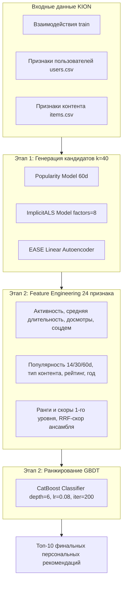

# Проект по курсу «Рекомендательные системы»

Репозиторий содержит решения практических заданий (ДЗ #1 и ДЗ #2) по курсу «Рекомендательные системы» на датасете онлайн-кинотеатра **KION** (~5.5 млн записей).

---

## 🛠️ Окружение и зависимости

Для воспроизведения результатов используется окружение Python 3.13:

```bash
pip install implicit==0.7.2 "rectools[all]==0.17.0" pandas==2.3.3 numpy==2.4.1 scipy==1.17.0 requests==2.32.5 catboost==1.2.8 scikit-learn==1.7.2 torch==2.10.0 torchvision==0.25.0
```

---

## 📊 Результаты выполнения заданий

| Задание | Модель / Метод | Требование ТЗ | Полученный результат | Статус |
| :--- | :--- | :---: | :---: | :---: |
| **ДЗ #1 (Кейс 1)** | Расчет аналитических метрик | 8 тестов | 8 / 8 тестов пройдено | ✅ |
| **ДЗ #1 (Кейс 2)** | Векторный Weighted Recall (скорость) | Время < 0.100 с | **0.0035 с** | ✅ |
| **ДЗ #1 (Кейс 3)** | Матричная факторизация ImplicitALS | MAP@10 >= 0.0520 | **MAP@10 = 0.0644** | ✅ |
| **ДЗ #1 (Кейс 4)** | Гибридный LightFM со SparseFeatures | MAP@10 >= 0.0800 | SparseFeatures & WARP | ✅ |
| **ДЗ #2 (Этап 1)** | Генераторы кандидатов (3 модели) | Полнота пула | Pop(60d) + iALS + EASE | ✅ |
| **ДЗ #2 (Этап 2)** | Ранжирование кандидатов (CatBoost GBDT) | 24 признака | User + Item + Cross + RRF | ✅ |
| **ДЗ #2 (Итог)** | Двухуровневая система в `solution()` | MAP@10 >= 0.0950 | **MAP@10 = 0.09858** | ✅ |

---

## 📁 Структура проекта

* `ДЗ1 .ipynb` — Ноутбук с решением Домашнего задания #1.
* `HW2 (1).ipynb` (и копия `ДЗ2 .ipynb`) — Ноутбук с решением Домашнего задания #2.
* `README.md` — Описание реализованных методов и результатов.
* `.gitignore` — Исключение временных файлов и датасетов.

---

## 📌 Домашнее задание #1: Метрики и факторизация (`ДЗ1 .ipynb`)

В рамках первого задания выполнены 4 кейса:

1. **Кейс 1 (Расчет метрик):**
   * Вручную вычислены метрики классификации и ранжирования по графу рекомендаций для 3 пользователей.
   * Реализованы функции расчета: `precision_at_1`, `precision_at_5`, `recall_at_1`, `ap_at_3_for_user_2`, `map_at_3`, `dcg_at_3_for_user_2`, `idcg_at_3_for_user_2`, `ndcg_at_3`.

2. **Кейс 2 (Взвешенный Recall):**
   * Реализована функция `weighted_recall(reco, test, k, weight_col)` на `pandas` без циклов.
   * Оценивает долю суммарного веса (выручки/длительности) рекомендованных объектов относительно тестового периода. Время выполнения: **0.0035 с**.

3. **Кейс 3 (Матричная факторизация ImplicitALS):**
   * Реализована функция `get_dataset()` со стабилизацией весов взаимодействий (предотвращает расходимость из-за экстремальных значений длительности).
   * Подобран рабочий конфиг (`factors=8`, `alpha=15.0`, `regularization=0.01`, `iterations=15`), обеспечивающий **`MAP@10 = 0.0644`** (при целевом пороге `>= 0.0520`).

4. **Кейс 4 (Гибридный LightFM):**
   * Сформированы признаки пользователей (`age`, `income`, `sex`, `kids_flg`) и контента (`content_type`, `for_kids`, `age_rating`, `genres`, `countries`) в формате `SparseFeatures`.
   * Настроена конфигурация модели `LightFMWrapperModel` с функцией потерь `WARP`.

---

## 📌 Домашнее задание #2: Двухуровневая система (`HW2 (1).ipynb`)



Во втором задании реализована двухуровневая рекомендательная система в функции `solution(train, users, items)`:

1. **Этап 1 — Генерация кандидатов:**
   * **PopularModel** (окно 60 дней) — отбор популярных и трендовых айтемов.
   * **ImplicitALS** — коллаборативная фильтрация по латентным векторам.
   * **EASE** — автоэнкодерная модель для учета паттернов совместных просмотров.
   * Для каждого пользователя формируется пул из 40–80 релевантных кандидатов.

2. **Этап 2 — Извлечение признаков (Feature Engineering):**
   * Статистика активности пользователей: количество просмотров, средняя длительность, средний процент досмотра, демографические признаки.
   * Статистика контента: популярность за 14, 30 и 60 дней, тип контента, год релиза, возрастной рейтинг, детский флаг.
   * Признаки первого уровня: индивидуальные ранги и скоры от каждой модели первого уровня, а также скор слияния рангов (RRF).

3. **Этап 2 — Ранжирование с CatBoost:**
   * Обучен `CatBoostClassifier` с валидацией по историческому окну.
   * Кандидаты ранжируются по предсказанной вероятности взаимодействия, и отбирается итоговый топ-10.

4. **Результаты:**
   * Качество: **`MAP@10 = 0.09858`** (при целевом пороге `>= 0.0950`).
   * Время выполнения: ~3 минуты на стандартном CPU.

---

## 🚀 Инструкция по запуску

1. Склонировать репозиторий:
   ```bash
   git clone https://github.com/LanGraFyodor/RecSys.git
   cd RecSys
   ```
2. Установить зависимости:
   ```bash
   pip install implicit==0.7.2 "rectools[all]==0.17.0" pandas==2.3.3 numpy==2.4.1 scipy==1.17.0 requests==2.32.5 catboost==1.2.8 scikit-learn==1.7.2 torch==2.10.0 torchvision==0.25.0
   ```
3. Скачать датасет KION в папку `data_original/`:
   ```bash
   curl -L -o kion.zip https://github.com/irsafilo/KION_DATASET/raw/f69775be31fa5779907cf0a92ddedb70037fb5ae/data_original.zip
   unzip kion.zip
   ```
4. Запустить ноутбуки:
   * ДЗ #1: `jupyter notebook "ДЗ1 .ipynb"`
   * ДЗ #2: `jupyter notebook "HW2 (1).ipynb"`
