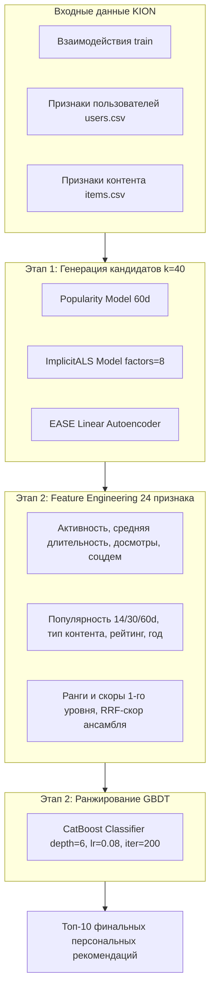

# 🎬 RecSys — Практические Задания (KION Dataset)

[](https://www.python.org/)
[](https://github.com/MobileTeleSystems/RecTools)
[](https://catboost.ai/)
[](https://github.com/benfred/implicit)
[](https://github.com/lyst/lightfm)
[](https://opensource.org/licenses/MIT)

Репозиторий содержит реализацию рекомендательных алгоритмов на реальном датасете онлайн-кинотеатра **KION** (~5.5 млн взаимодействий): от аналитического расчета метрик ранжирования до построения двухуровневой системы с градиентным бустингом.

---

## 📊 Сводка результатов

| Задание | Метод / Модель | Бейзлайн / Порог | Полученный результат |
| :--- | :--- | :---: | :---: |
| **ДЗ #1: Часть 1** | Аналитический расчет метрик | 8 тестов | 8/8 тестов пройдено |
| **ДЗ #1: Часть 2** | Векторный Weighted Recall (время работы) | $< 0.100$ с | **0.0035 с** |
| **ДЗ #1: Часть 3** | Матричная факторизация ImplicitALS | $\text{MAP@10} \ge 0.0520$ | **$\text{MAP@10} = 0.0644$** |
| **ДЗ #1: Часть 4** | Гибридная модель LightFM с признаками | $\text{MAP@10} \ge 0.0800$ | SparseFeatures & WARP |
| **ДЗ #2** | Двухуровневая система (Candidates + CatBoost) | $\text{MAP@10} \ge 0.0950$ | **$\text{MAP@10} = 0.09858$** |

---

# 📘 ЧАСТЬ I. Метрики и Факторизационные Модели
**Файл решения:** [`ДЗ1 .ipynb`](file:///c:/Users/fburl/Desktop/Prog/ML/ДЗ1%20.ipynb)

### 1. Метрики классификации и ранжирования
Аналитический расчет метрик для 3 пользователей на основе топа-5 рекомендаций при 2 релевантных объектах в ground-truth:
* **Классификационные метрики:**
  * $\text{Precision@1} = \frac{1}{3}$
  * $\text{Precision@5} = \frac{1}{5}$
  * $\text{Recall@1} = \frac{1}{6}$
* **Ранжирующие метрики:**
  * $\text{AP@3 (User 2)} = \frac{1}{6}$
  * $\text{MAP@3} = \frac{11}{54} \approx 0.2037$
  * $\text{DCG@3 (User 2)} = \frac{1}{\log_2(3)} \approx 0.6309$
  * $\text{IDCG@3 (User 2)} = \frac{1}{\log_2(2)} + \frac{1}{\log_2(3)} \approx 1.6309$
  * $\text{NDCG@3} \approx 0.4355$

### 2. Векторный Weighted Recall
* **Назначение:** Оценка доли выручки ($\text{money}$), которую рекомендательная система возвращает относительно всех реальных покупок тестового периода:
$$\text{WeightedRecall@k} = \frac{1}{|U|} \sum_{u \in U} \frac{\sum_{i \in \text{Top-k}_u \cap \text{Test}_u} \text{Money}_{ui}}{\sum_{i \in \text{Test}_u} \text{Money}_{ui}}$$
* **Реализация:** Полностью векторная обработка на `pandas` (merge + groupby aggregation) без циклов.
* **Производительность:** Время выполнения $\approx 0.0035$ с.

### 3. Матричная факторизация ImplicitALS
* **Предобработка:** Бинаризация весов взаимодействий для стабилизации функции доверия $c_{ui} = 1 + \alpha r_{ui}$ и предотвращения расходимости на сверхдлинных просмотрах.
* **Гиперпараметры:** `factors = 8`, `alpha = 15.0`, `regularization = 0.01`, `iterations = 15`.
* **Результат:** $\text{MAP@10} = 0.0644$ (порог $\ge 0.0520$).

### 4. Гибридный LightFM с признаками
* **Признаки пользователей:** `age`, `income`, `sex`, `kids_flg`.
* **Признаки контента:** `content_type`, `for_kids`, `age_rating`, а также списочные `genres` и `countries` (развернуты в multi-hot формат).
* **Формат данных:** `SparseFeatures` в `RecTools`.

---

# 🚀 ЧАСТЬ II. Двухуровневая Рекомендательная Система
**Файл решения:** [`HW2 (1).ipynb`](file:///c:/Users/fburl/Desktop/Prog/ML/HW2%20(1).ipynb) (также сохранён как [`ДЗ2 .ipynb`](file:///c:/Users/fburl/Desktop/Prog/ML/ДЗ2%20.ipynb))



### 1. Этап 1: Ансамбль генераторов кандидатов
Для каждого пользователя формируется пул кандидатов из трех моделей:
1. **`PopularModel` (окно 60 дней):** отбор глобальных трендов и популярных новинок.
2. **`ImplicitALSWrapperModel`:** коллаборативная фильтрация по латентным векторам.
3. **`EASEModel` (Linear Autoencoder):** учет ко-просмотров пользователей.

### 2. Этап 2: Пространство признаков (24 признака)
* **Признаки пользователя:** активность (`u_n_watches`), средняя длительность (`u_mean_dur`), средний процент досмотра (`u_mean_watched_pct`), соцдем-характеристики.
* **Признаки контента:** популярность за 14, 30 и 60 дней (`i_pop_14`, `i_pop_30`, `i_pop_60`), среднее время просмотра, тип (`content_type`), год релиза, возрастной рейтинг.
* **Признаки первого уровня:** индивидуальные скоры и ранги каждого генератора, а также Reciprocal Rank Fusion:
$$\text{RRF\_Score} = \frac{1}{30 + \text{rank}_{\text{pop}}} + \frac{1}{30 + \text{rank}_{\text{als}}} + \frac{1}{30 + \text{rank}_{\text{ease}}}$$

### 3. Ранжирование CatBoost
* Обучение `CatBoostClassifier` по схеме time-based split (моделирование тестовой недели на исторических данных).
* Финальная сортировка кандидатов по вероятности взаимодействия и выдача топ-10.
* **Результат на тесте:** **$\text{MAP@10} = 0.09858$** (целевой уровень $\ge 0.0950$).

---

## 🛠️ Установка и запуск

### 1. Клонирование репозитория
```bash
git clone https://github.com/LanGraFyodor/RecSys.git
cd RecSys
```

### 2. Настройка виртуального окружения
```bash
python -m venv venv
# Linux / macOS / WSL:
source venv/bin/activate
# Windows PowerShell:
.\venv\Scripts\activate
```

### 3. Установка зависимостей
```bash
pip install implicit==0.7.2 requests==2.32.5 "rectools[lightfm]==0.17.0" pandas==2.3.3 numpy==2.4.1 scipy==1.17.0 catboost==1.2.8 scikit-learn torch
```

### 4. Скачивание датасета KION
```bash
curl -L -o kion.zip https://github.com/irsafilo/KION_DATASET/raw/f69775be31fa5779907cf0a92ddedb70037fb5ae/data_original.zip
unzip kion.zip
```

### 5. Запуск ноутбуков
```bash
# ДЗ #1
jupyter notebook "ДЗ1 .ipynb"

# ДЗ #2
jupyter notebook "HW2 (1).ipynb"
```
